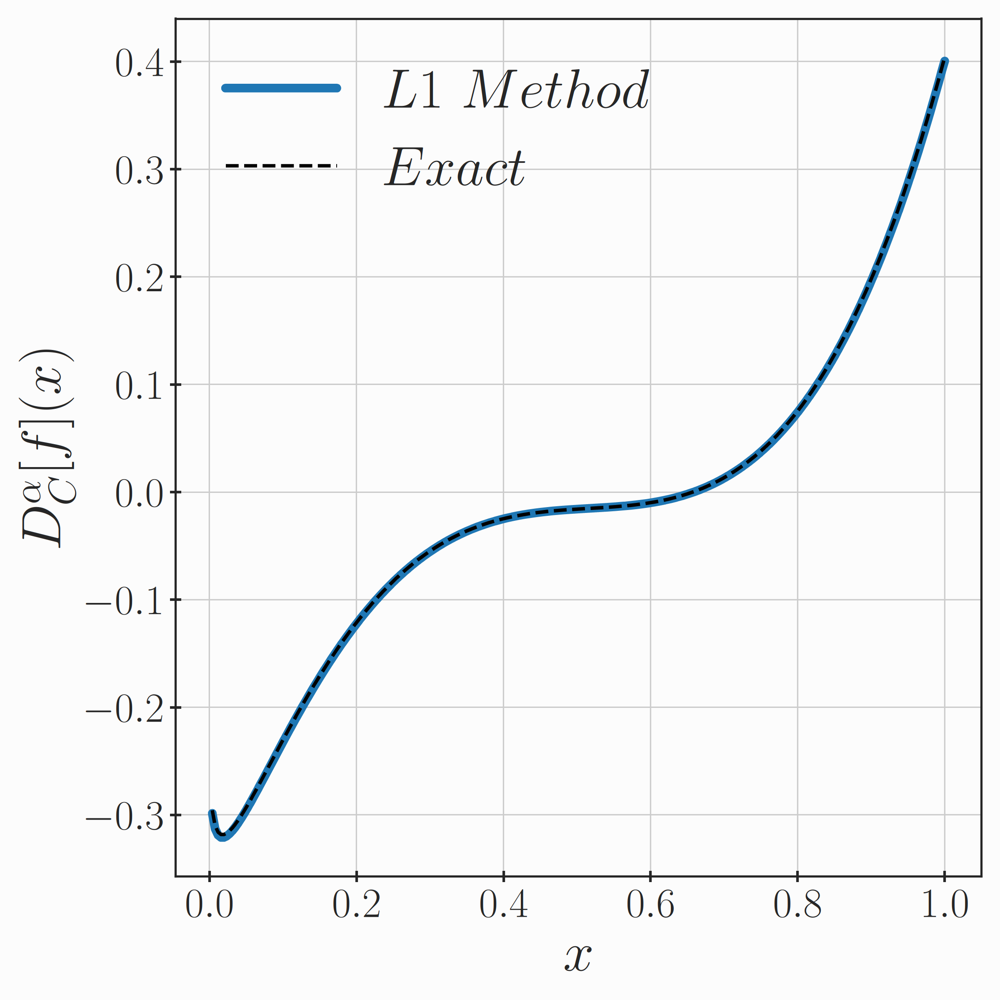

Tutorials
=========

Evaluating Caputo Derivatives
-----------------------------

To get an idea of the intended API and workflow of the library, we have here
a small example using the classical Caputo fractional order derivative.
Its definition is, see e.g. [Li2020]_,

.. math::

    D^\alpha_C[f](x) = \frac{1}{\Gamma(n - \alpha)} \int_a^x
        \frac{f^{(n)}(s)}{(x - s)^{\alpha + 1 - n}} \,\mathrm{d}s,

where :math:`n = \lceil \alpha \rceil` is the smallest integer larger than
:math:`\alpha`. In this example, we take :math:`\alpha \in (0, 1)`, so :math:`n = 1`,
and use a simple test function

.. math::

    f(x) = \left(\frac{1}{2} + x\right)^4

and its Caputo fractional order derivative given by

.. math::

    D^\alpha_C[f](x) =
        - \frac{x^{1 - \alpha}}{2 \Gamma(2 - \alpha)}
        + \frac{3 x^{2 - \alpha}}{\Gamma(3 - \alpha)}
        - \frac{12 x^{3 - \alpha}}{\Gamma(4 - \alpha)}
        + \frac{24 x^{4 - \alpha}}{\Gamma(5 - \alpha)}.

In code, we can write them as below

.. literalinclude:: ../examples/caputo-derivative-l1.py
    :lines: 14-24
    :language: python
    :linenos:

To estimate the derivative, we use the classical L1 method (see Chapter 4.1 in
[Li2020]_ or Chapter 3 in [Karniadakis2019]_). The methods are set up as
follows

.. literalinclude:: ../examples/caputo-derivative-l1.py
    :lines: 27-30
    :language: python
    :linenos:

These methods are described by the :class:`~pycaputo.derivatives.CaputoDerivative`
and :class:`~pycaputo.differentiation.CaputoL1Method` classes.
We can then set up a grid and evaluate the derivative at all points

.. literalinclude:: ../examples/caputo-derivative-l1.py
    :lines: 32-36
    :language: python
    :linenos:

For the chosen number of points, this gives an error of about :math:`10^{-3}`.
The resulting approximation can be see below

The complete example can be found in
:download:`examples/caputo-derivative-l1.py <../examples/caputo-derivative-l1.py>`.

