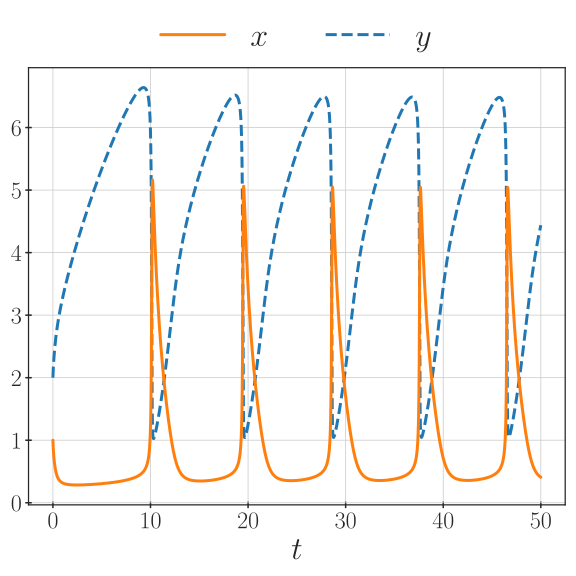
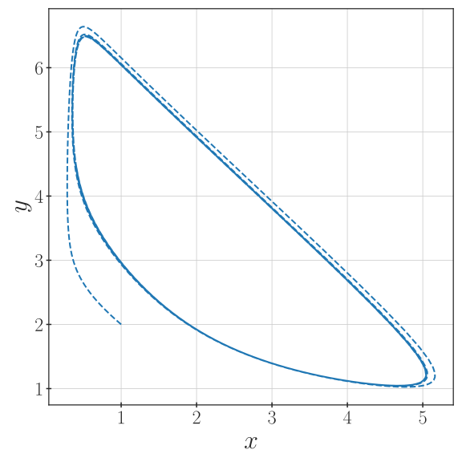

Tutorials
=========

Evaluating Caputo Derivatives
-----------------------------

To get an idea of the intended API and workflow of the library, we have here
a small example using the classical Caputo fractional order derivative.
Its definition is, see e.g. [Li2020]_,

.. math::

    D^\alpha_C[f](x) = \frac{1}{\Gamma(n - \alpha)} \int_a^x
        \frac{f^{(n)}(s)}{(x - s)^{\alpha + 1 - n}} \,\mathrm{d}s,

where :math:`n = \lceil \alpha \rceil` is the smallest integer larger than
:math:`\alpha`. In this example, we take :math:`\alpha \in (0, 1)`, so :math:`n = 1`,
and use a simple test function

.. math::

    f(x) = \left(\frac{1}{2} + x\right)^4

and its Caputo fractional order derivative given by

.. math::

    D^\alpha_C[f](x) =
        - \frac{x^{1 - \alpha}}{2 \Gamma(2 - \alpha)}
        + \frac{3 x^{2 - \alpha}}{\Gamma(3 - \alpha)}
        - \frac{12 x^{3 - \alpha}}{\Gamma(4 - \alpha)}
        + \frac{24 x^{4 - \alpha}}{\Gamma(5 - \alpha)}.

In code, we can write them as below

.. literalinclude:: ../examples/caputo-derivative-l1.py
    :lines: 13-23
    :language: python
    :linenos:

To estimate the derivative, we use the classical L1 method (see Chapter 4.1 in
[Li2020]_ or Chapter 3 in [Karniadakis2019]_). The methods are set up as
follows

.. literalinclude:: ../examples/caputo-derivative-l1.py
    :lines: 26-32
    :language: python
    :linenos:

These methods are described by the :class:`~pycaputo.derivatives.CaputoDerivative`
and :class:`~pycaputo.differentiation.CaputoL1Method` classes.
We can then set up a grid and evaluate the derivative at all points

.. literalinclude:: ../examples/caputo-derivative-l1.py
    :lines: 34-37
    :language: python
    :linenos:

For the chosen number of points, this gives an error of about :math:`10^{-3}`.
The resulting approximation can be see below

The complete example can be found in
:download:`examples/caputo-derivative-l1.py <../examples/caputo-derivative-l1.py>`.

Solving Differential Equations
------------------------------

In this example, we will look at solving a simple non-linear fractional-order
ordinary differential equation (FODE). The model we have chosen for this is the
classic Brusselator system

.. math::

   \begin{cases}
   D_C^\alpha x = a - (\mu + 1) x + x^2 y, \\
   D_C^\alpha y = \mu x - x^2 y,
   \end{cases}

where we take :math:`(a, \mu) = (1, 4)`, an order :math:`\alpha = 0.8`, and
initial conditions :math:`(x_0, y_0) = (1, 2)`. For these parameters, the
system has a stable limit cycle, which we can observe (see [Garrappa2015b]_).
The right-hand side for this system can be implemented as

.. literalinclude:: ../examples/brusselator-predictor-corrector.py
    :lines: 13-19
    :language: python
    :linenos:

We can now start setting up our numerical solver based on the standard
Predictor-Corrector method (PECE) described in [Diethelm2002]_ and implemented
by :class:`~pycaputo.fode.CaputoPECEMethod`. The solver is then set up as

.. literalinclude:: ../examples/brusselator-predictor-corrector.py
    :lines: 27-41
    :language: python
    :linenos:

We can see here that we have chosen to use a left-sided
:class:`~pycaputo.derivatives.CaputoDerivative` with an order :math:`\alpha`.
The solver will use a fixed time step of :math:`10^{-2}` on the interval
:math:`[0, 50]` to properly observe the limit cycle behavior. For
Predictor-Corrector schemes, the corrector step can be repeated multiple times,
but here we choose ``corrector_iterations=1`` to only use a single iteration.

Now that the solver is set up, we can simply evolve the equation time step by
time step to get all the solutions. This will use the :func:`pycaputo.fode.evolve`
iterator as follows

.. literalinclude:: ../examples/brusselator-predictor-corrector.py
    :lines: 43-56
    :language: python
    :linenos:

The solution as a function of time can be seen below.

The limit cycle can be better visualized in phase space as shown below.

The complete example can be found in
:download:`examples/brusselator-predictor-corrector.py <../examples/brusselator-predictor-corrector.py>`.
