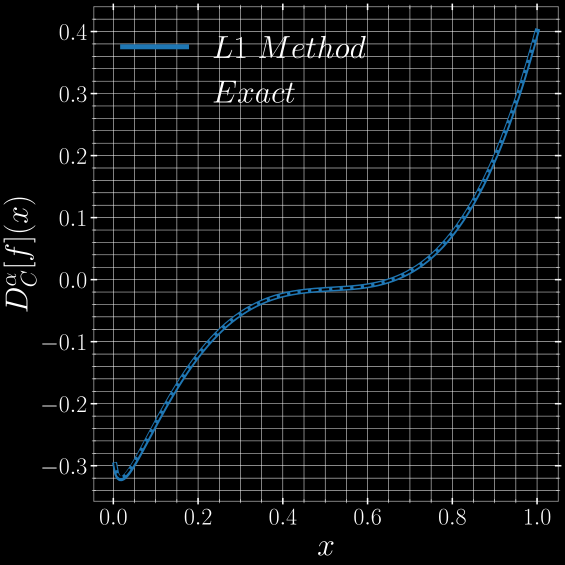
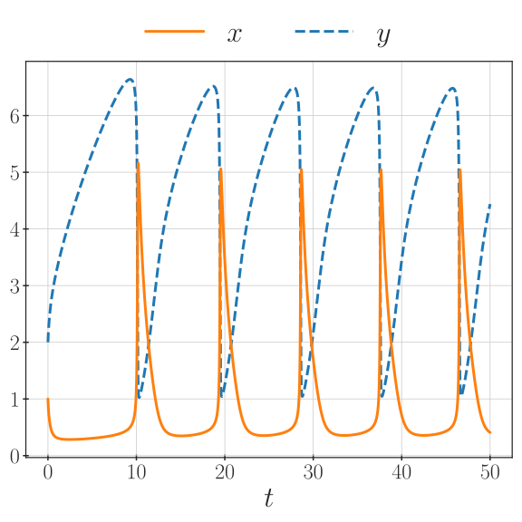
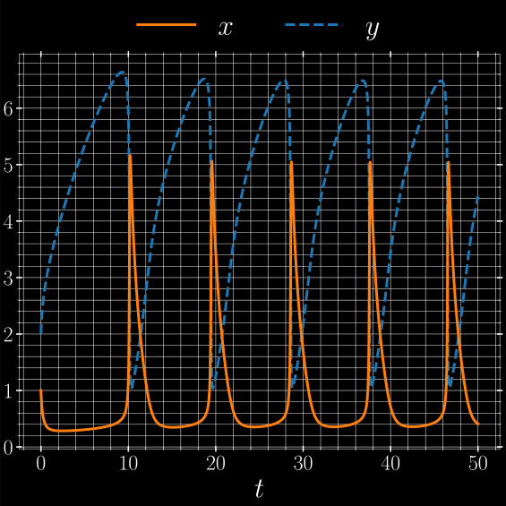
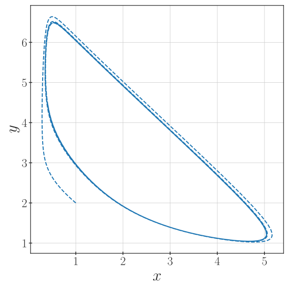
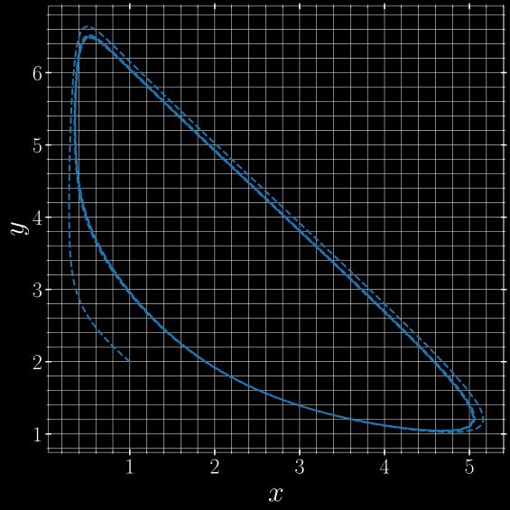
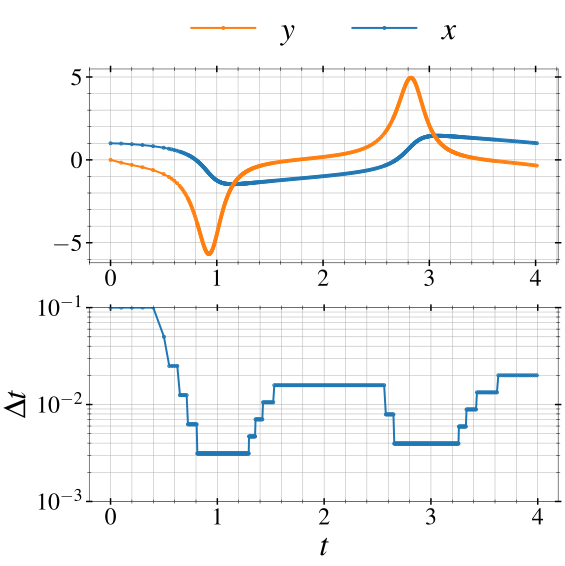
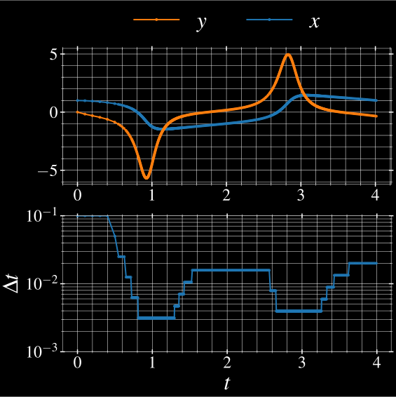
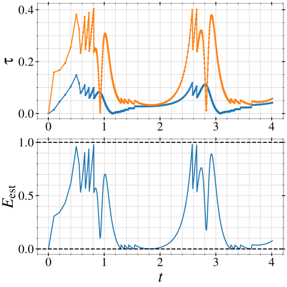

Tutorials
=========

Evaluating Caputo Derivatives
-----------------------------

To get an idea of the intended API and workflow of the library, we have here
a small example using the classical Caputo fractional order derivative.
Its definition is, see e.g. [Li2020]_,

.. math::

    D^\alpha_C[f](x) = \frac{1}{\Gamma(n - \alpha)} \int_a^x
        \frac{f^{(n)}(s)}{(x - s)^{\alpha + 1 - n}} \,\mathrm{d}s,

where :math:`n = \lceil \alpha \rceil` is the smallest integer larger than
:math:`\alpha`. In this example, we take :math:`\alpha \in (0, 1)`, so :math:`n = 1`,
and use a simple test function

.. math::

    f(x) = \left(\frac{1}{2} + x\right)^4

and its Caputo fractional order derivative given by

.. math::

    D^\alpha_C[f](x) =
        - \frac{x^{1 - \alpha}}{2 \Gamma(2 - \alpha)}
        + \frac{3 x^{2 - \alpha}}{\Gamma(3 - \alpha)}
        - \frac{12 x^{3 - \alpha}}{\Gamma(4 - \alpha)}
        + \frac{24 x^{4 - \alpha}}{\Gamma(5 - \alpha)}.

In code, we can write them as below

.. literalinclude:: ../examples/caputo-derivative-l1.py
    :lines: 16-26
    :lineno-match:
    :language: python

To estimate the derivative, we use the classical L1 method (see Chapter 4.1 in
[Li2020]_ or Chapter 3 in [Karniadakis2019]_). The methods are set up as
follows

.. literalinclude:: ../examples/caputo-derivative-l1.py
    :lines: 29-35
    :lineno-match:
    :language: python

These methods are described by the :class:`~pycaputo.derivatives.CaputoDerivative`
and :class:`~pycaputo.differentiation.CaputoL1Method` classes.
We can then set up a grid and evaluate the derivative at all points

.. literalinclude:: ../examples/caputo-derivative-l1.py
    :lines: 37-40
    :lineno-match:
    :language: python

For the chosen number of points, this gives an error of about :math:`10^{-3}`.
The resulting approximation can be see below

The complete example can be found in
:download:`examples/caputo-derivative-l1.py <../examples/caputo-derivative-l1.py>`.

Solving Differential Equations
------------------------------

In this example, we will look at solving a simple non-linear fractional-order
ordinary differential equation (FODE). The model we have chosen for this is the
classic Brusselator system

.. math::

   \begin{cases}
   D_C^\alpha[x](t) = a - (\mu + 1) x + x^2 y, \\
   D_C^\alpha[y](t) = \mu x - x^2 y,
   \end{cases}

where we take :math:`(a, \mu) = (1, 4)`, an order :math:`\alpha = 0.8`, and
initial conditions :math:`(x_0, y_0) = (1, 2)`. For these parameters, the
system has a stable limit cycle, which we can observe (see [Garrappa2015b]_).
The right-hand side for this system can be implemented as

.. literalinclude:: ../examples/brusselator-predictor-corrector.py
    :lines: 16-20
    :lineno-match:
    :language: python

We can now start setting up our numerical solver based on the standard
Predictor-Corrector method (PECE) described in [Diethelm2002]_ and implemented
by :class:`~pycaputo.fode.caputo.PECE`. The solver is then set up as

.. literalinclude:: ../examples/brusselator-predictor-corrector.py
    :lines: 28-42
    :lineno-match:
    :language: python

We can see here that we have chosen to use a solver for the Caputo derivative
an order :math:`\alpha`. The solver will use a fixed time step of :math:`10^{-2}`
on the interval :math:`[0, 50]` to properly observe the limit cycle behavior. For
Predictor-Corrector schemes, the corrector step can be repeated multiple times,
but here we choose ``corrector_iterations=1`` to only use a single iteration.

Now that the solver is set up, we can simply evolve the equation time step by
time step to get all the solutions. This will use the :func:`pycaputo.stepping.evolve`
iterator as follows

.. literalinclude:: ../examples/brusselator-predictor-corrector.py
    :lines: 44-61
    :lineno-match:
    :language: python

The solution as a function of time can be seen below.

The limit cycle can be better visualized in phase space as shown below.

The complete example can be found in
:download:`examples/brusselator-predictor-corrector.py <../examples/brusselator-predictor-corrector.py>`.

Adaptive Time Stepping
----------------------

In this example, we will look at solving a nonlinear fractional-order equation
using adaptive time stepping (see :mod:`pycaputo.controller`). The model we have
chosen for this is the classic van der Pol system

.. math::

   \begin{cases}
   D_C^\alpha[x](t) = y, \\
   D_C^\alpha[y](t) = \mu (1 - x^2) y - x,
   \end{cases}

where :math:`\mu = 4`, :math:`\alpha = 0.8` and the initial condition is taken
to be :math:`(x_0, y_0) = (1, 0)`. As we will see, this is close to a limit
cycle of the oscillator (see e.g. [Jannelli2020]_). The right-hand side for this
system is implemented as

.. literalinclude:: ../examples/van-der-pol-adaptive-pece.py
    :lines: 21-29
    :lineno-match:
    :language: python

We can now start setting up our numerical solver based on the standard
Predictor-Corrector method (PECE) implemented in
:class:`~pycaputo.fode.caputo.PECE`. The time adaptation is based on the
results from [Jannelli2020]_ and implemented in
:class:`~pycaputo.controller.JannelliIntegralController`. The controller is
set up as follows

.. literalinclude:: ../examples/van-der-pol-adaptive-pece.py
    :lines: 37-48
    :lineno-match:
    :language: python

We can see here that we have chosen a time interval of :math:`[0, 4]` to see
the start of the limit cycle. We have also used other parameters better described
in [Jannelli2020]. Briefly, ``qmin`` and ``qmax`` are used to decrease or
increase the time step by a fixed value, while ``chimin`` and ``chimax`` are
used to normalize the Jannelli error estimator. Then, we can set up the solver
itself

.. literalinclude:: ../examples/van-der-pol-adaptive-pece.py
    :lines: 50-59
    :lineno-match:
    :language: python

For the solver we set the desired order ``alpha`` and choose two corrector
iterations, to be sure that the second-order accuracy is achieved. For an
adaptive scheme, it is important to also get an estimate for the initial time
step. This can be done using

.. literalinclude:: ../examples/van-der-pol-adaptive-pece.py
    :lines: 61-68
    :lineno-match:
    :language: python

Having set everything up, we can evolve our equation and gather any relevant data.
For the adaptive case, we are interested also in showing the behavior of the
error estimate and the time step in time. Here, we will only gather this information
for accepted steps.

.. literalinclude:: ../examples/van-der-pol-adaptive-pece.py
    :lines: 87-98
    :lineno-match:
    :language: python

We can now look at the solution and the corresponding time steps below.

We can see that the method indeed adapts with the solution. This is expected,
as it depends on :math:`|y_{n + 1} - y_n|`. However, a big downside of the
Jannelli method is the need to adequately choose the parameters :math:`\chi_{min}`
and :math:`\chi_{max}` that control when the solution is too large or too small.
The choice we have made above was made after a bit of trial and error and looking
a the value of the corresponding error estimator.

Below we have the value of the scalar error estimator and the values of the
Jannelli error estimator for each component. We can see here that the error is
generally maintained in :math:`[0, 1]` for all accepted steps, which is
equivalent to keeping the error in :math:`[\chi_{min}, \chi_{max}]` before
rescaling.

.. image:: van-der-pol-adaptive-pece-eest-dark.svg
    :class: only-dark
    :width: 75%
    :align: center
    :alt: Jannelli error estimator for the van der Pol system.

The complete example can be found in
:download:`examples/van-der-pol-adaptive-pece.py <../examples/van-der-pol-adaptive-pece.py>`.
